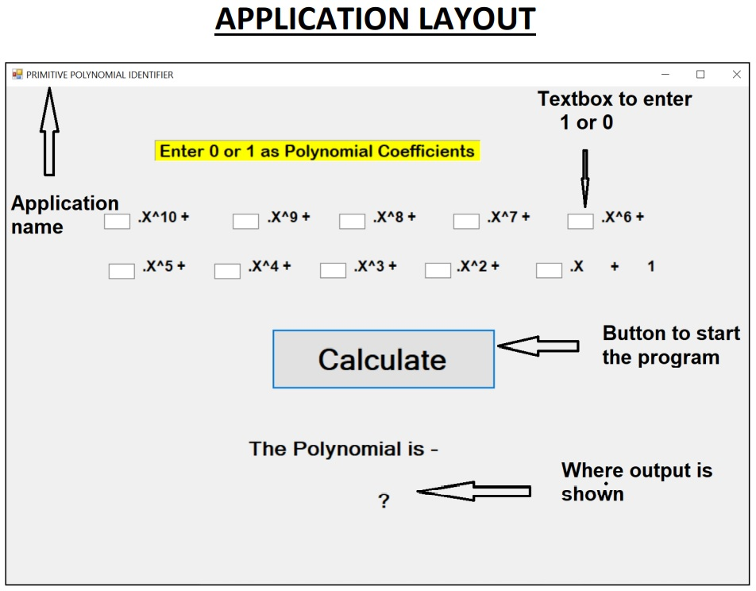

# Primitive-polynomial-identifier

We have written a C++ program to find a given polynomial is Primitive or not. The C++ program can
perform the operation on any polynomial of degree less than or equal to 10.

**Idea Used**
In the program we are first letting user to enter the degree of Polynomial. Then the user has to enter 1
or 0 as coefficients of each term. For example if X^2 is present in our polynomial its coefficient will be
entered as 1 and if it is not one of the term of polynomial its coefficient will be 0. Hence having
complete polynomial input.
These coefficients are placed in an array of denominator [], coefficient of X at index 1, coefficient of X^2
at index 2 and so on.
Now we find X^T + 1 and similarly place 1’s and 0’s in another array named numerator [].
Now we find a quotient term by subtracting degree of numerator and denominator. The denominators
1’s are copied into another array named temp1 [], but the position of 1’s are shifted by adding quotient
terms. For example if a 1 was present at 2
nd
index in denominator array, it will be at 2 + quotient term
index in temp array.
The temp array and denominator array are EXOR and the result is stored in numerator array. So we now
have a new numerator. The above process is repeated till we reach termination condition.
The termination occurs either when numerator index is all 0 (Our polynomial is primitive) or when
degree of numerator is less than degree of numerator (Our polynomial is not primitive).

**Application development**
We used Visual Studio 2019 software to generate executable program of the code. Slight changes in
program were made which includes taking inputs from textbox and converting those strings into integer
variable. Also output was forwarded to a label.
The design and layout of application was made using features of visual studio. We made changes in
predefined template to get required font, layout and size of the application.
